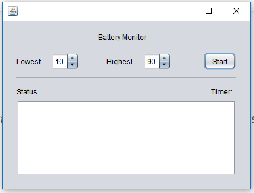
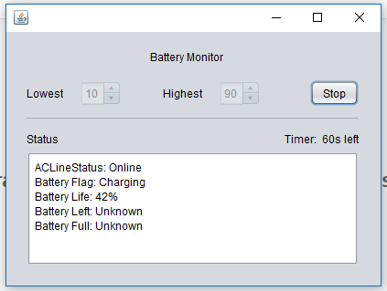

# BatteryMonitor
Tooling app to notifiy when laptop battery is up or down in certain range.

This app born with the goal of monitoring the battery level of laptops to notify the user when need to plug in or plug out the energy source.

